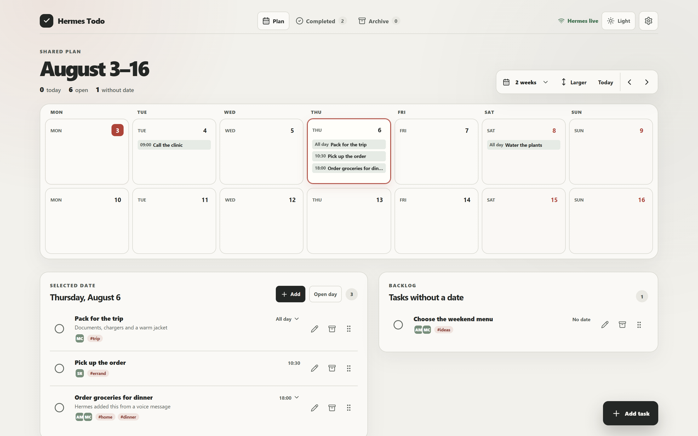
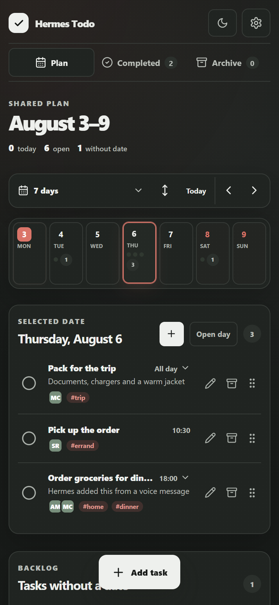
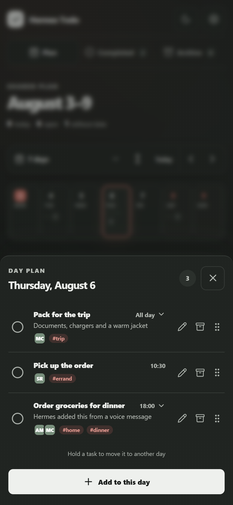
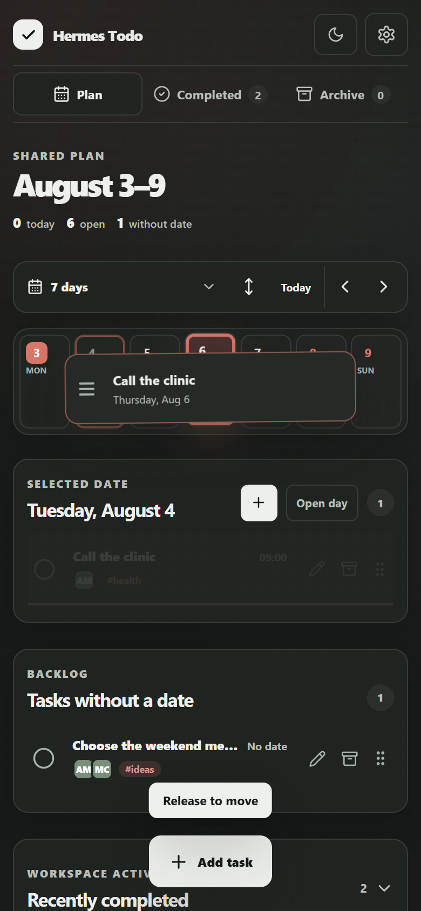
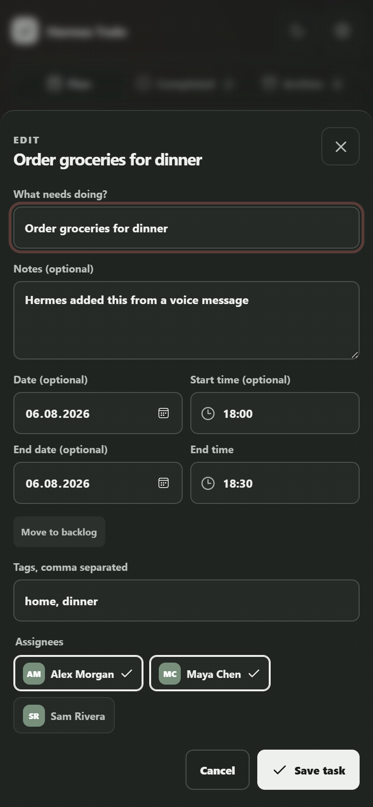
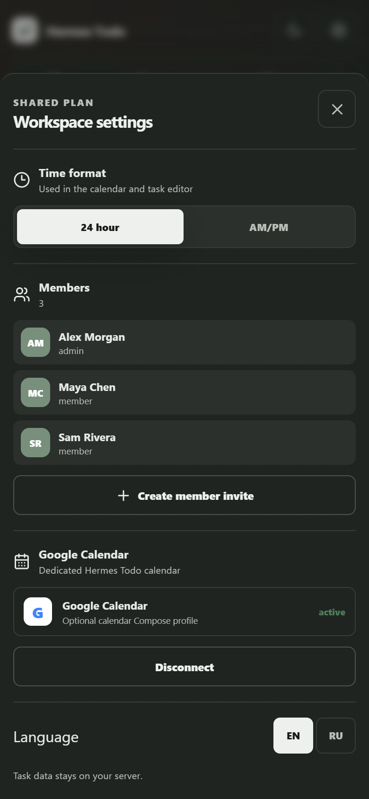
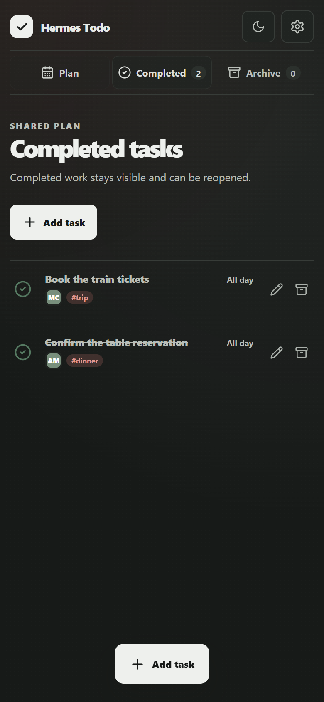

<div align="center">

<h1>Hermes Todo</h1>
<p><strong>Из разговора с Hermes — в общий план.</strong></p>
<p>Напишите Hermes или отправьте голосовое сообщение. Задачи, исполнители и даты появятся в простом календаре, который все участники видят и обновляют сообща.</p>
<p><a href="#от-разговора-к-делу">Как это работает</a> · <a href="#посмотреть-локально">Посмотреть демо</a> · <a href="#установка-для-реального-использования">Установить через Docker</a> · <a href="README.md">English</a></p>
<p>
  <a href="https://github.com/flufox/jnicq-hermes-todolist/actions/workflows/ci.yml"></a>
  <a href="https://github.com/flufox/jnicq-hermes-todolist/actions/workflows/security.yml"></a>
  <a href="CHANGELOG.md"></a>
  <a href="LICENSE"></a>
</p>

</div>

<a href="docs/assets/desktop-overview.png">
  
</a>

О делах часто договариваются в чате — и там же они теряются. Кто-то должен запомнить дату, перенести поручение в другой сервис и отдельно сообщить всем об изменениях.

Hermes Todo закрывает этот разрыв. Достаточно один раз сказать [Hermes Agent](https://github.com/NousResearch/hermes-agent), что нужно сделать. Поручение станет задачей в общем календаре, где семья, соседи или небольшая команда смогут назначить исполнителя, перенести срок и отметить результат.

> Hermes Todo — независимый community-проект. Он не связан с Nous Research или Telegram и не одобрен ими.

## От разговора к делу

> 🎙️ **«Hermes, добавь продукты на четверг в 18:00 и назначь Алекса и Майю».**

<table>
  <tr>
    <td width="33%"><strong>1. Скажите как обычно</strong><br /><br />Текстом или голосом в любом канале, который поддерживает Hermes Agent. Форму задачи заполнять не нужно.</td>
    <td width="33%"><strong>2. Hermes разберёт поручение</strong><br /><br />Плагин Hermes Todo превратит просьбу в задачу с датой, временем, тегами и исполнителями.</td>
    <td width="33%"><strong>3. Все увидят результат</strong><br /><br />Общее Telegram Mini App обновится и сохранит актуальный план перед глазами у каждого участника.</td>
  </tr>
</table>

Диалог и аудио обрабатывает Hermes Agent. Hermes Todo — визуальное общее пространство, которое получает структурированный результат через плагин.

## Все общие дела в одном месте

- **Весь план перед глазами.** Показывайте от 1 до 7 дней, две недели или четыре недели.
- **Сразу понятно, кто отвечает.** Назначайте одного или нескольких участников.
- **На день — полный список.** Двойное нажатие или кнопка **Открыть день** показывает все его задачи.
- **Планы легко менять.** Удерживайте задачу и переносите её пальцем или мышью на другую дату.
- **Столько деталей, сколько нужно.** Заметки, теги, весь день или точное время начала и окончания.
- **Все видят изменения.** Правки из Hermes и других Mini App появляются в общем представлении.
- **Данные остаются у вас.** Приложение разворачивается на вашем сервере, а архив можно восстановить.

## Интерфейс

<table>
  <tr>
    <th width="50%">Неделя одним взглядом</th>
    <th width="50%">Полный план дня</th>
  </tr>
  <tr>
    <td><a href="docs/assets/mobile-calendar.png"></a></td>
    <td><a href="docs/assets/mobile-day-plan.png"></a></td>
  </tr>
  <tr>
    <td><strong>Одно нажатие выбирает дату, два открывают весь день.</strong></td>
    <td><strong>Все задачи дня собраны в одном списке и идут по времени.</strong></td>
  </tr>
</table>

<table>
  <tr>
    <th width="50%">Перенос без повторного редактирования</th>
    <th width="50%">Понятная структура задачи</th>
  </tr>
  <tr>
    <td><a href="docs/assets/mobile-drag-task.png"></a></td>
    <td><a href="docs/assets/mobile-task-editor.png"></a></td>
  </tr>
  <tr>
    <td><strong>Удерживайте, перетащите, отпустите — детали задачи сохранятся.</strong></td>
    <td><strong>По умолчанию 24 часа; AM/PM включается в настройках.</strong></td>
  </tr>
</table>

<table>
  <tr>
    <th width="50%">Общий план для нескольких людей</th>
    <th width="50%">Выполненное не теряется</th>
  </tr>
  <tr>
    <td><a href="docs/assets/mobile-team-settings.png"></a></td>
    <td><a href="docs/assets/mobile-completed.png"></a></td>
  </tr>
  <tr>
    <td><strong>Пригласите участников и дайте всем один актуальный источник.</strong></td>
    <td><strong>Завершённые и архивные задачи остаются видимыми и восстановимыми.</strong></td>
  </tr>
</table>


## Посмотреть локально

Самый быстрый способ понять продукт. Нужен Node.js 22+, но не нужны Telegram-бот, домен, Docker или production-секреты.

```bash
git clone https://github.com/flufox/jnicq-hermes-todolist.git
cd jnicq-hermes-todolist
npm ci
npm run dev:demo
```

Откройте [http://127.0.0.1:5173](http://127.0.0.1:5173). Появится локальное пространство с синтетическими задачами. Демо намеренно работает только на loopback — не публикуйте его в сеть.

### Работаете с coding agent?

Скопируйте ему этот промпт:

> Склонируй `flufox/jnicq-hermes-todolist`, запусти локальное демо только на loopback и перед изменениями объясни структуру проекта. Не читай и не добавляй секреты в промпты или коммиты. Внеси одно точечное изменение, затем запусти тесты, production-сборку и release scan.

После изменений попросите выполнить:

```bash
npm test
npm run test:python
npm run build
npm run release:scan
```

## Установка для реального использования

Для первого запуска рекомендуем пошаговый установщик.

### Что понадобится

- Linux-сервер с Git, Docker Engine и Docker Compose v2;
- домен, DNS которого указывает на этот сервер;
- открытые порты 80 и 443 для рекомендуемого режима Caddy;
- Telegram и токен нового бота от [BotFather](https://t.me/BotFather);
- Hermes Agent 0.16.x — только если задачи должны приходить из разговоров с Hermes.

### 1. Создайте Telegram-бота

Откройте [BotFather](https://t.me/BotFather), отправьте `/newbot`, выполните его инструкции и сохраните полученный токен. Не добавляйте токен в коммиты и GitHub Issues.

### 2. Запустите установщик

```bash
git clone https://github.com/flufox/jnicq-hermes-todolist.git
cd jnicq-hermes-todolist
chmod +x hermes-todo
./hermes-todo setup
```

Для самой простой установки выберите `caddy`, когда появится вопрос о proxy mode. Установщик попросит домен, ACME email, часовой пояс, язык, название пространства и токен Telegram-бота. Затем он:

- проверит Docker Compose и токен бота;
- создаст приватные secret-файлы и локальную базу;
- запустит контейнеры и дождётся успешных health checks;
- подключит Mini App к кнопке меню бота;
- покажет одноразовый admin-инвайт, действующий 30 минут.

### 3. Откройте пространство

Откройте бота в Telegram, нажмите кнопку меню и введите напечатанный admin-инвайт. Должен появиться общий календарь. Остальных участников можно пригласить через **Настройки → Участники**.

Если приложение не стало healthy, запустите:

```bash
./hermes-todo doctor
```

### 4. Подключите Hermes Agent (необязательно)

Именно этот шаг включает сценарий `сообщение/аудио → общая задача`. Если установщик нашёл локальный Hermes 0.16.x и вы согласились подключить плагин, пропустите этот шаг.

В остальных случаях безопасно скопируйте значение из `secrets/hermes_agent_token` на машину с Hermes и выполните:

```bash
hermes plugins install https://github.com/flufox/jnicq-hermes-todolist.git --enable
hermes gateway restart
```

Установщик спросит два значения и сохранит их в приватном environment-файле Hermes:

- `HERMES_TODO_API_URL`: публичный origin, например `https://todo.example.com`, без `/api/agent/v1`;
- `HERMES_TODO_API_TOKEN`: скопированный scoped-токен; ввод будет скрыт.

Не ограничивайтесь временным `export` в одном shell: после перезапуска gateway значения должны сохраниться. Кроме скрытого поля установщика, не добавляйте токен в историю shell, AI-чаты, issues или репозиторий.

Проверьте подключение безопасной тестовой просьбой:

> «Hermes, добавь “Проверить Hermes Todo” на завтра в 10:00».

Задача должна появиться в Mini App. Установщик не ставит сам Hermes; плагин подключается через [официальный механизм Hermes](https://github.com/NousResearch/hermes-agent/blob/main/website/docs/user-guide/features/plugins.md).

## Что готово в релиз-кандидате v0.1.0

`v0.1.0` — дебютный публичный релиз-кандидат. Основной сценарий общих задач реализован и проверен локально; финальный тег ждёт описанных ниже проверок реального Docker runtime и связки Telegram/Hermes. Уже сейчас будем рады обратной связи, баг-репортам и первым контрибьюторам.

- одно общее пространство с ролями администратора и участника;
- создание, редактирование, выполнение, восстановление и архив задач;
- несколько исполнителей, теги, заметки, даты и точное время;
- диапазоны календаря 1–7 дней, две недели и четыре недели;
- полный день по двойному нажатию и перенос задач пальцем или мышью;
- живое обновление между Hermes и сессиями Mini App;
- 24-часовой формат по умолчанию и переключатель AM/PM;
- одноразовые инвайты и ограниченные отзывные токены агента;
- необязательная двусторонняя синхронизация с отдельным Google Calendar;
- зашифрованный переносимый бэкап и восстановление с проверкой целостности;
- русский и английский интерфейсы.

Первый релиз намеренно сфокусирован: один инстанс обслуживает одну небольшую общую группу и одну реплику приложения. Production-вход работает через Telegram. Внутри Hermes Todo нет микрофона, SaaS, мультитенантности или автоматического победителя конфликтов Google Calendar. Возможные следующие шаги описаны в [roadmap](ROADMAP.md).

## Приватность и восстановление

Текст задач хранится без полевого шифрования внутри защищённой SQLite-базы. Используйте полное шифрование диска, зашифрованные внешние бэкапы, обновления ОС и доверенный TLS proxy. Приложение и workers работают не от root, с read-only root filesystem, полностью сброшенными capabilities и `no-new-privileges`; Caddy сохраняет только `NET_BIND_SERVICE` для портов прослушивания.

Hermes получает заметки задач только по явному запросу инструмента. Его API не умеет безвозвратно удалять задачи или менять настройки пространства, OAuth и синхронизации. Перед публикацией инстанса прочитайте [политику безопасности](SECURITY.md), [модель угроз](docs/THREAT_MODEL.md) и [журнал последней проверки](docs/SECURITY_REVIEW.md).

<details>
<summary><strong>Расширенная настройка и эксплуатация</strong></summary>

### Режимы proxy

Рекомендуемый профиль `caddy` публикует порты 80/443 и автоматически получает HTTPS-сертификаты. Выберите `external`, если TLS уже завершает другой reverse proxy; тогда Hermes Todo слушает только `127.0.0.1:3000`.

Удалённый Hermes должен обращаться к Agent API по публичному HTTPS. Обычный HTTP допустим только для локальной разработки.

### Google Calendar

1. В [Google Cloud](https://support.google.com/cloud/answer/15549257) включите Google Calendar API, настройте OAuth consent screen и создайте OAuth-клиент типа **Web application**.
2. Добавьте точный authorized redirect URI, заменив домен:

   ```text
   https://todo.example.com/api/v1/admin/integrations/google/callback
   ```

3. Измените `.env`, чтобы профиль календаря сохранялся при обновлениях: укажите `COMPOSE_PROFILES=caddy,calendar` или `COMPOSE_PROFILES=external-proxy,calendar`.
4. Запустите worker, откройте **Настройки → Google Calendar**, введите client ID и secret и подключите аккаунт:

```bash
docker compose up -d --wait
```

Hermes Todo создаёт отдельный календарь и работает только с ним. OAuth refresh credentials шифруются AES-256-GCM. Одновременные изменения получают статус `needs_attention`; ни одна сторона не побеждает молча.

### Повседневные команды

```bash
./hermes-todo doctor
./hermes-todo invite-member
./hermes-todo rotate-token
./hermes-todo backup
./hermes-todo backup --portable
./hermes-todo restore --archive backups/example.htbackup
./hermes-todo update
```

Сервис бэкапов хранит семь ежедневных и четыре еженедельных снимка SQLite. Переносимый бэкап включает базу и нужный master key в защищённом парольной фразой AES-256-GCM контейнере.

### Основная конфигурация

Несекретные значения находятся в `.env`. Telegram-токен, master key базы и токен Hermes Agent хранятся только в доступных владельцу файлах внутри `secrets/`.

| Переменная | Назначение | По умолчанию |
| --- | --- | --- |
| `HERMES_TODO_DOMAIN` | Публичный домен | обязательно |
| `HERMES_TODO_TIMEZONE` | Часовой пояс пространства в формате IANA | `UTC` |
| `HERMES_TODO_LOCALE` | Локаль пространства при установке; язык интерфейса каждый клиент выбирает отдельно | `en` |
| `COMPOSE_PROFILES` | `caddy` или `external-proxy`; можно добавить `calendar` | `caddy` |
| `HERMES_TODO_CALENDAR_POLL_MS` | Интервал опроса календаря | `30000` |

</details>

## Разработка и участие

Стек намеренно небольшой: React/Vite, Express 5, SQLite, Python-плагин Hermes, Docker Compose и необязательный worker Google Calendar. Начните с [CONTRIBUTING.md](CONTRIBUTING.md), затем используйте:

```bash
npm ci
npm test
npm run test:python
npm run build
npm run dev:demo
```

Архитектура и API описаны в [docs/ARCHITECTURE.md](docs/ARCHITECTURE.md) и [контракте OpenAPI 3.1](docs/openapi-agent.yaml). История релизов находится в [CHANGELOG.md](CHANGELOG.md), а правила сообщества — в [Code of Conduct](CODE_OF_CONDUCT.md).

## Лицензия

[MIT](LICENSE)
